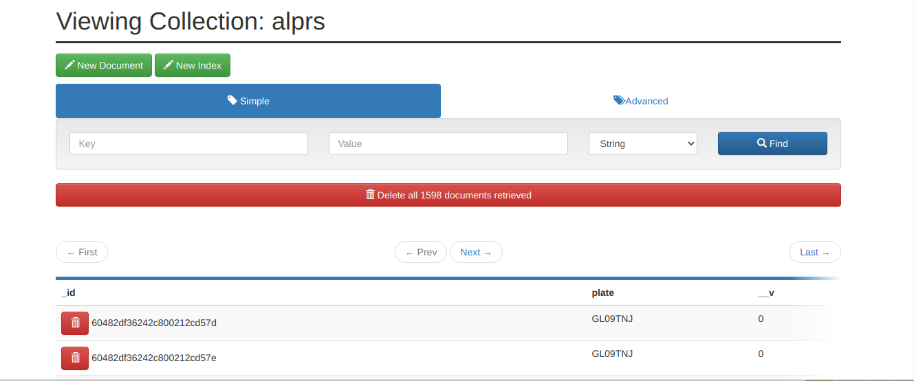

## Overview 
### WebUI for OpenALPR 

Using a video file containing Licence plates for input.
OpenALPR daemon(alprd)  will POST to the Nodejs application. 
The Licence plate number are stored in a MongoDB data base.

 
#### Feature
- Upload video files
- Manage alprd 
- Perform MongoDB CRUD Operations

#### Contents

##### Backends
- Node.js
- Express.js
- MongoDB
- Mongo-Express
##### Frontends
- jsGrid
- Material Design Lite 
### Requirements
- Docker and Docker Compose.
### Usage
``` bash
#Start the container
docker-compose up -d               
```
#### Access using
http://localhost:9091/
