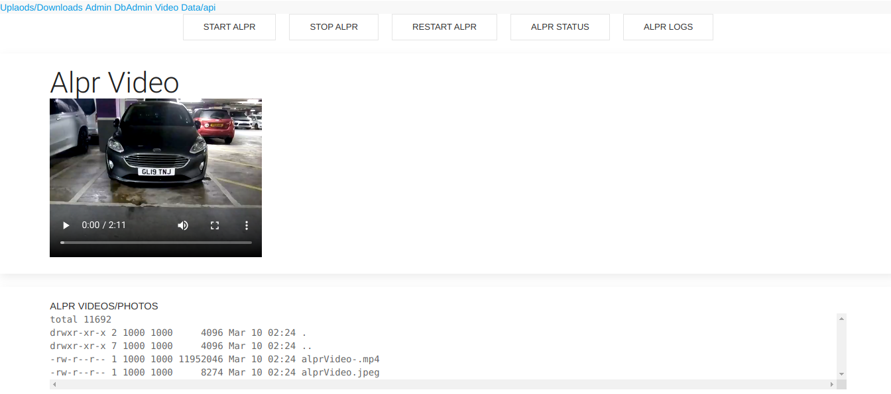
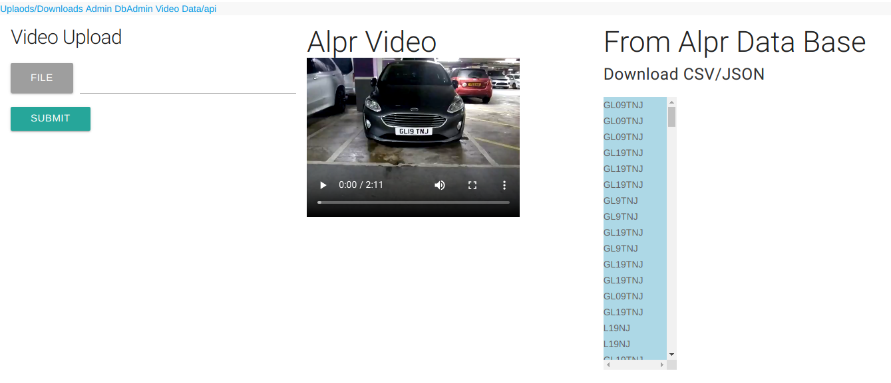

## Overview 
REST API for Open/ALPR with Express.js, Mongodb and Mongo Express with Docker.

### Requirements
- Docker and Docker Compose
#### Install Docker CE and Docker Compose follow the post from. https://micrometreuk.github.io/2020/02/07/docker.html
``` bash
#Start the container
docker-compose up -d               
```
``` bash
#Update/upgarde container  
docker-compose stop
docker-compose down -v
docker-compose rm -f
docker-compose pull
docker-compose up -d --build
```
#### Access using
http://localhost:9091/

  |  |   
